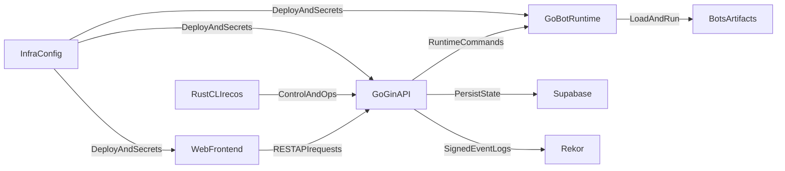
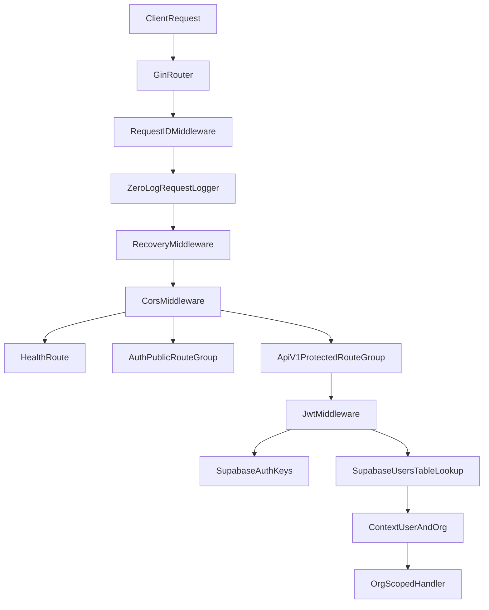
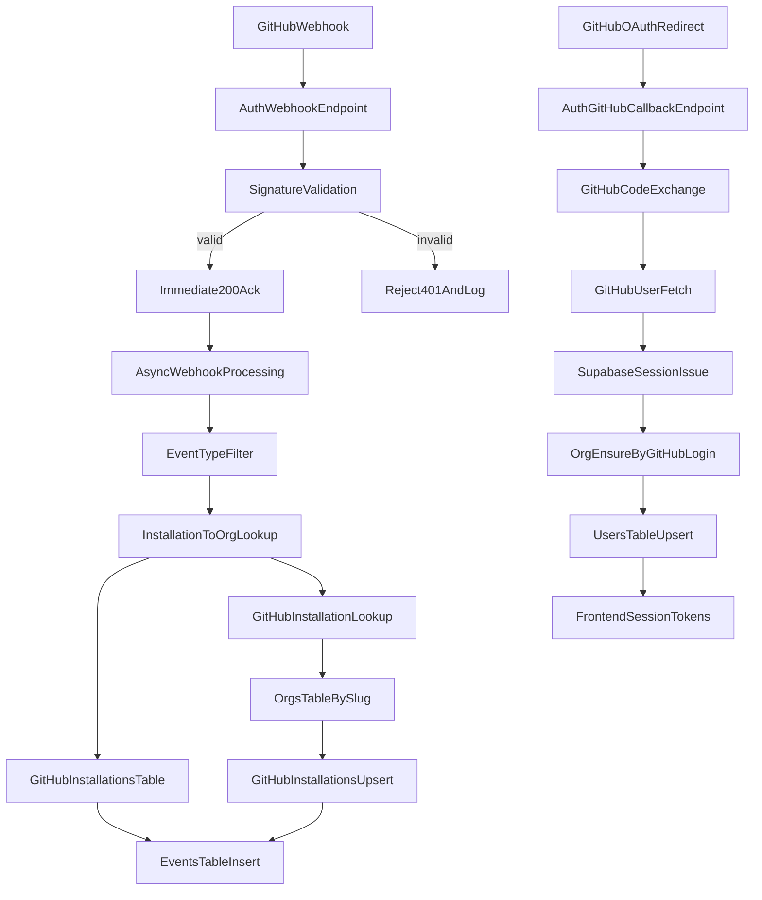
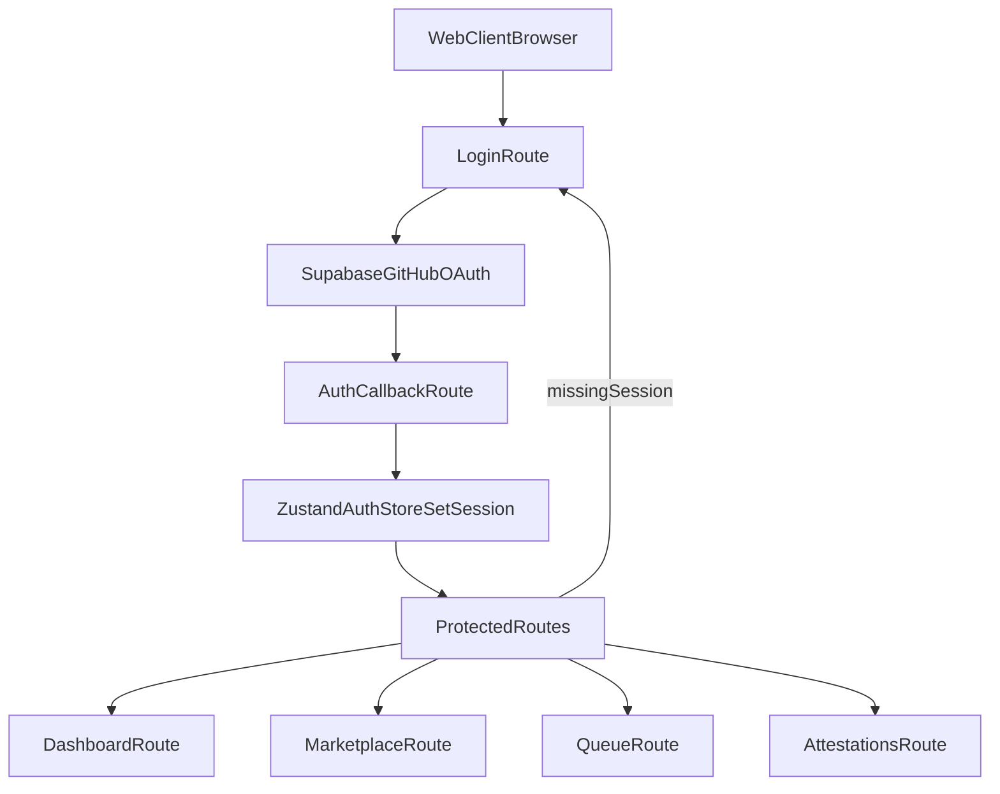
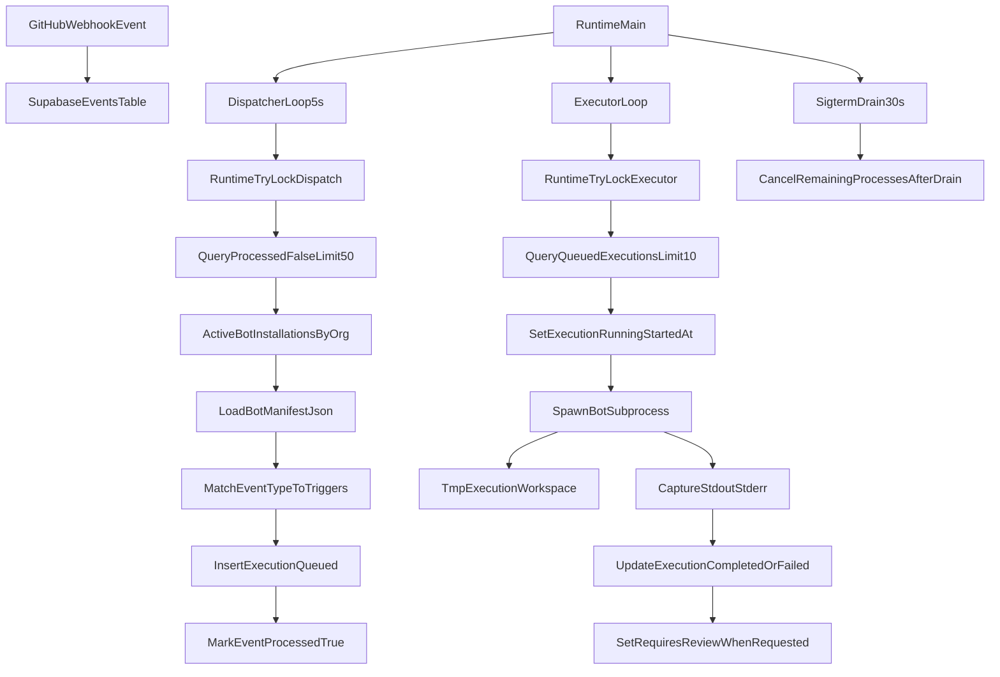
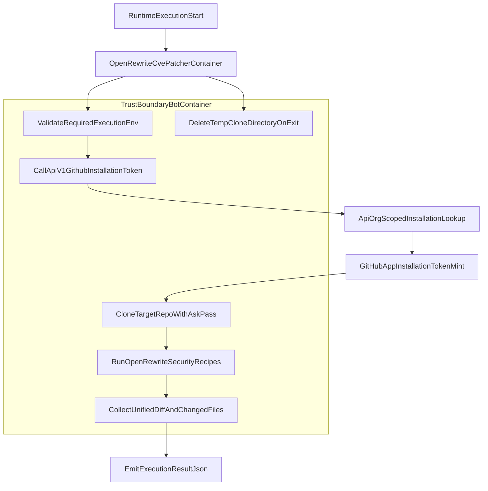
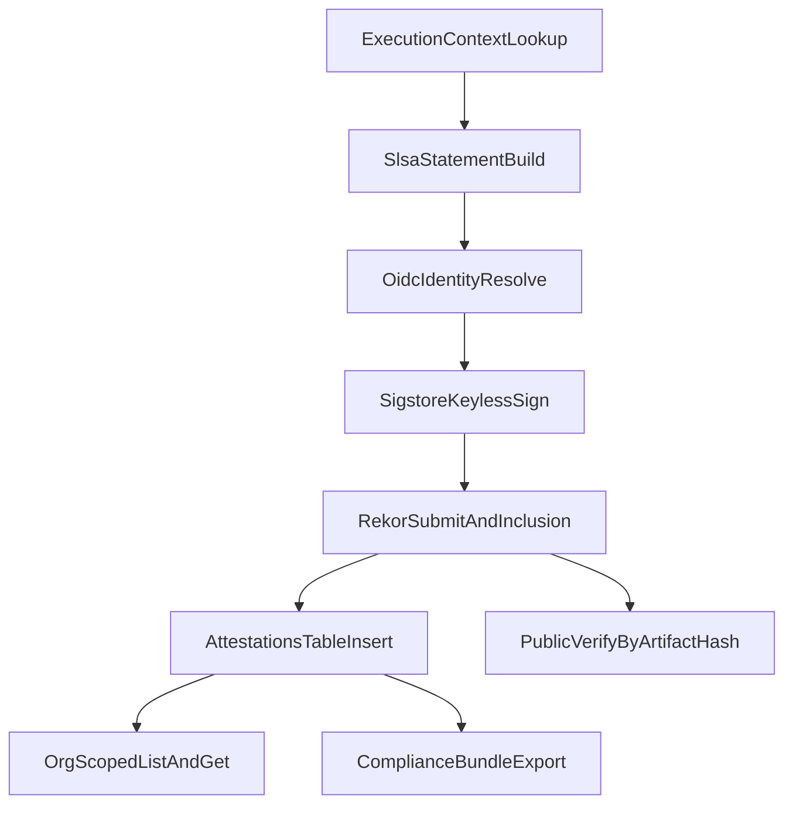

# ReconcileOS Data Flow Diagram

## Notes

- This diagram is intentionally high-level for bootstrap phase.
- Detailed trust boundaries and threat model annotations can be added once service interfaces are implemented.

## API Auth And Org Scope Flow

## GitHub App Integration Flow

## Web Frontend Auth And Route Guard Flow

## Runtime Event Dispatch And Execution Flow

## OpenRewrite CVE Patcher Flow

### Credential Lifecycle Notes
- The bot requests a short-lived GitHub installation token from a JWT-protected API endpoint scoped to the authenticated org.
- The token remains in process memory only and is supplied to git through `GIT_ASKPASS` to avoid git credential helper persistence.
- Temporary clone workspace and helper script are deleted on every exit path via trap-based cleanup.

## Sigstore Attestation Engine Flow

