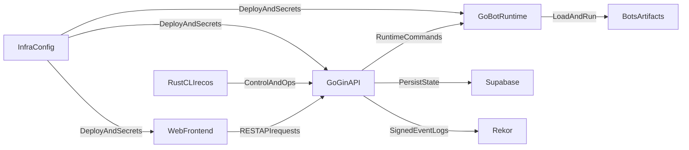

# ReconcileOS Data Flow Diagram

## Notes

- This diagram is intentionally high-level for bootstrap phase.
- Detailed trust boundaries and threat model annotations can be added once service interfaces are implemented.
